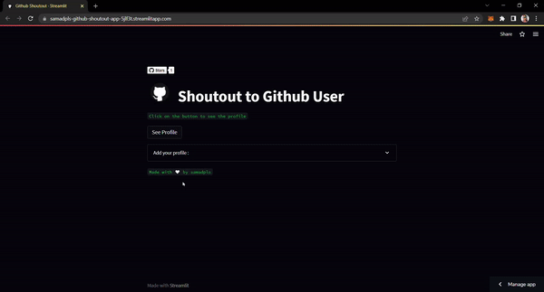

  
  
 
-   GitHub-shoutout is the web application that displays the registered user's GitHub profile. Get a chance to win a shoutout. You just have to enrol yourself. Anyone can volunteer by clicking the "add to your Profile" drop-down menu

## Demo 

### How does this work ?
-  For registering, you can input your GitHub handle in the input area and press enter. 

- To get a random  fellow developer, you can press the 'See Profile' button. 

 

`You can contribute to this amazing project by making it more better`

